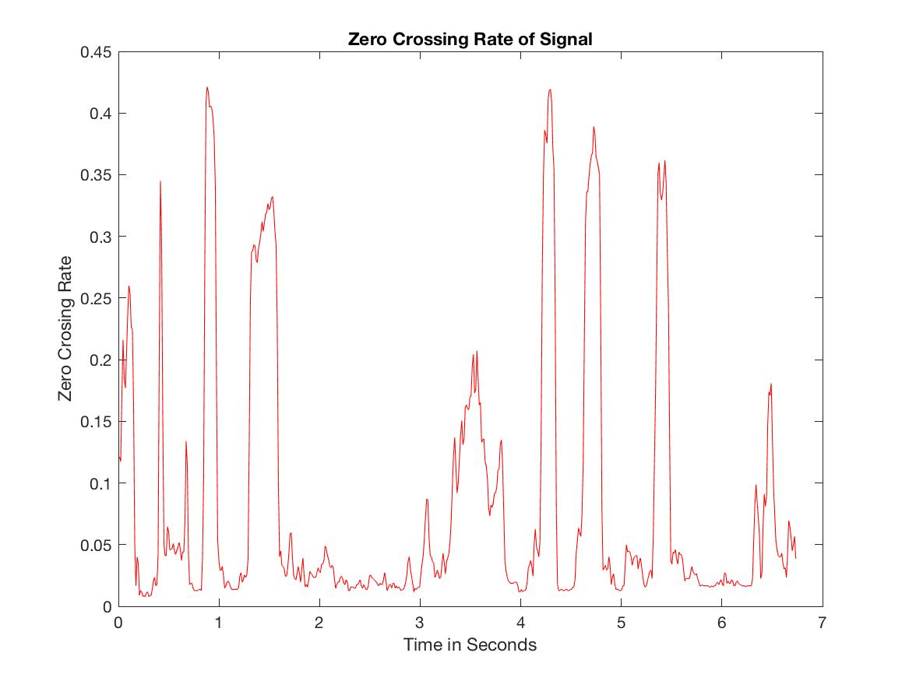
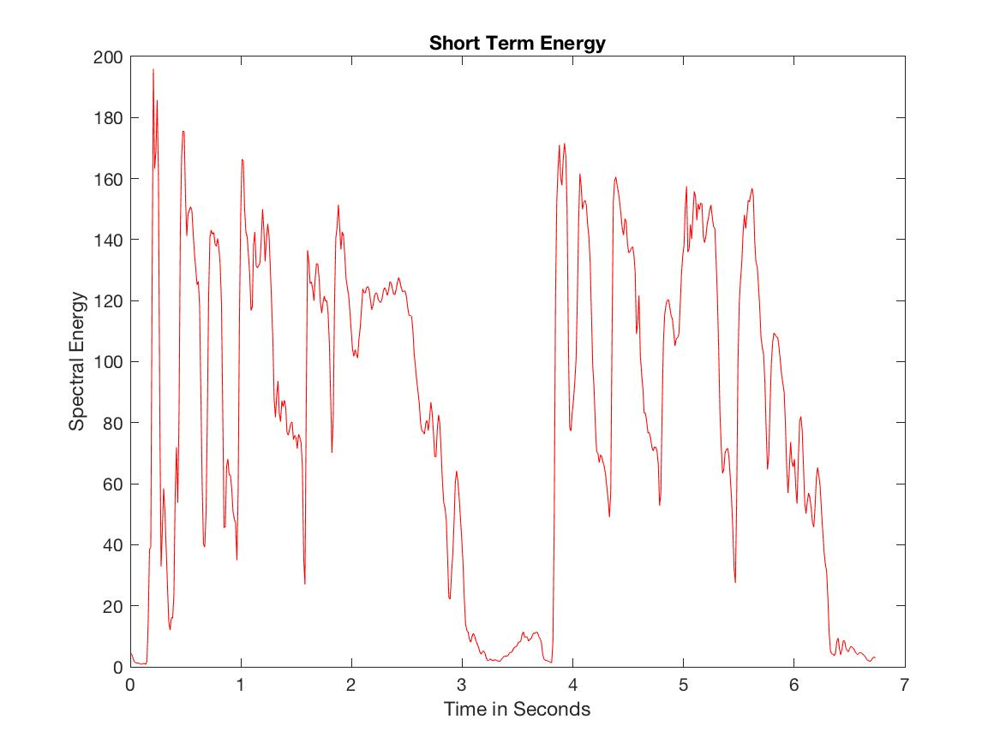

[This link is a test](./test.html)


# MUMT 307 Vocal Harmonizer

This vocal harmonizer was created using Max/MSP and MATLAB and was submitted as final project for MUMT 307: Music and Audio Computing 2. Presented by Camilo Gómez and Erica Huynh a.k.a Huynez & Co.

## Introduction
We were inspired by watching live performances that use a vocal harmonizer. In these live performances, a singer gets to sing and harmonize with themselves just by singing into a machine. We found this fascinating, and we thought it would be fun to implement by using concepts covered in our class.

Our main goals were to find a way to implement a vocal harmonizer in real-time. We wanted it to pitch shift a singer’s voice, so that it would sound like the singer is singing harmonies in addition to the melody. We also wanted to replace fricative sounds with noise, so that we were not applying pitch shifts to the fricative sounds. In order for the harmonies to sound convincing, we also wanted to retain the spectral envelope (formants) of the singer’s voice, and apply it to each harmony voice. Another goal was to make the vocal harmonizer as user-friendly as possible. We wanted the user to be able to select a key and sing into the harmonizer, without having to do much else. We will walk you through each of these components in this website.

## The Interface
> screenshot of the entire interface on Max/MSP
> 
> remember to comment the patch before uploading image

## Pre-processing

### Why do we need to pre-process the signal?

In order to create a working harmonizer, we needed to be able to process voiced and voiceless sounds separately. Voiced sounds should be transposed, but voiceless sounds should not. Voiced sounds are produced by vibrations of the vocal folds and are filtered by the vocal tract. These are the sounds that we want to transpose, while keeping the formants created by the filtering of the vocal tract the same. Several methods have been developed for voiced/voiceless sound recognition and separation. One approach uses the zero crossing rate and the short term energy. In order to test our code, we used an acapella excerpt from the song ["Champagne" by MuruMuru](https://open.spotify.com/track/32nlotNdfPe5PjyEovnrM7?si=IEqlPLsLTxqynP417MJfDA). The file can be found on our GitHub repository.

#### Zero Crossing Rate

The zero crossing rate of a signal is defined as the rate of sign changes of the signal. Generally, voiceless sounds have a higher zero crossing rate than voiced sounds, as they are composed of sibilances, plosives, etc. By varying a zero crossing rate threshold, we can fine tune our detection of voiceless sounds using the zero crossing rate. In MATLAB, we can compute the zero crossing rate of a frame by taking the average of sign difference of the samples within the frame in the following fashion:

```c++
zcr = 0.5 * mean ( abs( diff( sign( input ))));
```

The function ```diff ``` returns the value of ```sign(input(n)) - sign(input(n-1))``` for n = 2 to n = N. We can test different thresholds and determine a value that works for our purposes. If the zero crossing rate of the signal exceeds the threshold, we assume that the current sound is voiceless, and should not be transposed. The following graph shows the zero crossing rate of the test file:




#### Short Term Energy

The short term energy of a signal is defined as sum of the square of the value of the samples. An average is taken to avoid dependency on the frame length. A similar result can be achieved by getting the sum of the absolute value of the samples. In general, the short term energy for voiced sounds should be rather stable. If we compare the short term energy of a frame with the previous one and find a significant difference, this may indicate that the signal contains a voiceless sound. In MATLAB we can implement such formula in the following fashion, for n = 1 to n = N:

```c++
ste = mean( sum(abs( ( y(n) ))))
```
The following graph shows the short term energy of the test file:



### Comparing STE and ZCR


### Comparing VST Plugin to Max External
> describe thought process and choices


| Max/MSP Patcher/Abstraction      | Max External  | VST Plugin (Using MATLAB)   |
|:----------------------|:------------------------|:-----------------------------|
|Less flexibility for sample by sample processing| Sample by sample and frame by frame manipulation|Sample by sample and frame by frame manipulation|  
|Fast prototyping and testing | Laborious to write, test and debug     | Faster prototyping, testing and debugging. audioTestBench included in MATLAB   |
|No coding/compiling         | Max SDK needed          | MATLAB Audio System Toolbox includes generateAudioPlugin function              |


## Pitch-shifting
> on Max/MSP
> 
> decided to have one upper and lower harmony and explain why
> 
> wanted it to be user friendly, so that anyone can use it without requiring music theory background

### gizmo~: Pitch Shift
> how it works, benefits, cons
> 
> include image

### retune~: Pitch Detection
> how it works, benefits, cons
> 
> how it enhances
> 
> explain how pitch shift calculations are made... user friendly
> 
> include images

## Formant Analyses
> god bless us
> 
> #Pray4Huynez2k18

## Effects
> cool stuff
> 
> general image of subpatch

### Delay
> explain parameters
> 
> tapin~ and tapout~

### Feedback
> how it was implemented


## Limitations and Outlook
> what we would have done differently
> 
> limitations in general
> 
> is it usable to the public?

## References
Cycling ‘74. (2018). Max 7.3.5.

Lerch, A. (2012). Instantaneous features. In <i>An Introduction to Audio Content Analysis: Applications in Signal Processing and Music Informatics </i>(31–70). Hoboken, New Jersey: John Wiley & Sons Inc.

MathWorks. (2018). MATLAB.

Steinberg Media Technologies GmbH. (2016). Audio Systems Toolbox  - A Matlab Toolbox.


### Header 3

```js
// Javascript code with syntax highlighting.
var fun = function lang(l) {
  dateformat.i18n = require('./lang/' + l)
  return true;
}
```

```ruby
# Ruby code with syntax highlighting
GitHubPages::Dependencies.gems.each do |gem, version|
  s.add_dependency(gem, "= #{version}")
end
```

#### Header 4

*   This is an unordered list following a header.
*   This is an unordered list following a header.
*   This is an unordered list following a header.

##### Header 5

1.  This is an ordered list following a header.
2.  This is an ordered list following a header.
3.  This is an ordered list following a header.

###### Header 6

| head1        | head two          | three |
|:-------------|:------------------|:------|
| ok           | good swedish fish | nice  |
| out of stock | good and plenty   | nice  |
| ok           | good `oreos`      | hmm   |
| ok           | good `zoute` drop | yumm  |

### There's a horizontal rule below this.

* * *

### Here is an unordered list:

*   Item foo
*   Item bar
*   Item baz
*   Item zip

### And an ordered list:

1.  Item one
1.  Item two
1.  Item three
1.  Item four

### And a nested list:

- level 1 item
  - level 2 item
  - level 2 item
    - level 3 item
    - level 3 item
- level 1 item
  - level 2 item
  - level 2 item
  - level 2 item
- level 1 item
  - level 2 item
  - level 2 item
- level 1 item

### Small image


### Large image


### Definition lists can be used with HTML syntax.

<dl>
<dt>Name</dt>
<dd>Godzilla</dd>
<dt>Born</dt>
<dd>1952</dd>
<dt>Birthplace</dt>
<dd>Japan</dd>
<dt>Color</dt>
<dd>Green</dd>
</dl>

```
Long, single-line code blocks should not wrap. They should horizontally scroll if they are too long. This line should be long enough to demonstrate this.
```

```
The final element.
```
