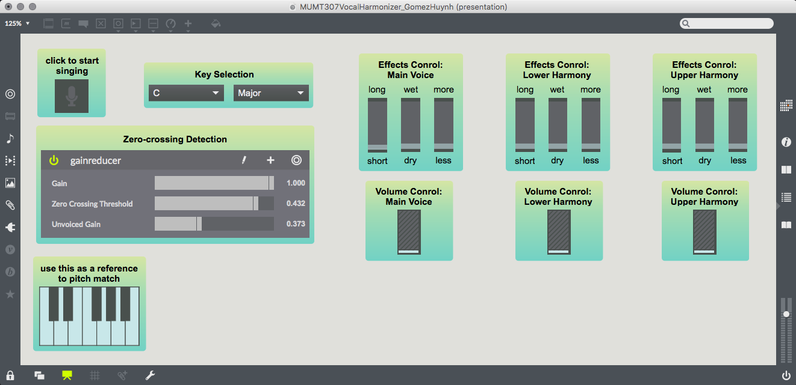

[Previous: Home](./index.md)

## The Interface

The user must click the microphone button in order to start singing. They then can select the key in which they wish to sing in. In the zero-crossing detection panel, the user can control the volume of the voiced sounds (gain), how sensitive the detection of fricative sounds will be (zero-crossing threshold), and the volume of the fricative sounds that will be converted to noise (unvoiced gain). For users who do not have absolute pitch, the keyboard allows them to select a reference note at which they could match its pitch. The user can also control three effects parameters for each voice: the delay in milliseconds (short to long), the volume of the non-delayed signal relative to the delayed signal (dry to wet), and the amount of feedback or echo (less to more). Majority of the user controls should be fairly simple to use and understand, with the exception of zero-crossing controls. The explanation for that can be found in the next section.

[Next: Pre-processing](./preprocessing.md)
