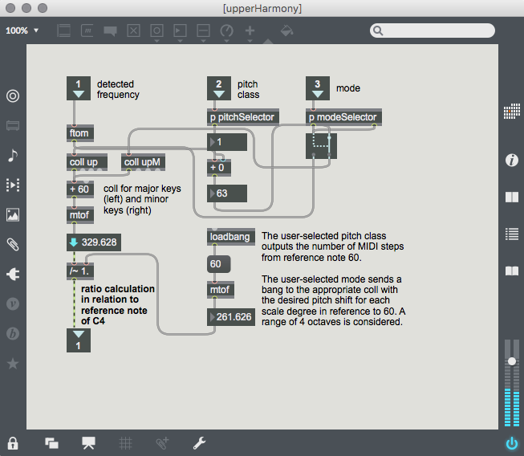

[Home](./index.md)

[Previous: Pre-processing](./preprocessing.md)

## Pitch-shifting
In order for harmonies to be heard, pitch-shifting must take place. Our goal was to create two harmonies: one at a higher pitch compared to the signer’s voice, and the other at a lower pitch compared to the singer’s voice. Pitch-shifting was implemented on Max/MSP primarily with the `gizmo~` object, but also with the help of the `retune~` object. The goal of implementing the pitch-shift, was to be as user-friendly as possible. We wanted any individual to be able to use this vocal harmonizer without requiring any music theory background.

### Pitch-Shift: `gizmo~`
The `gizmo~` object on Max/MSP was mainly used for the pitch-shifting. We decided to pitch-shift one of harmony up a third, and pitch shift the other harmony down a third.

`gimzo~` works inside a `pfft~` object. The `pfft~` object is a subpatch that computes a Fast Fourier Transform for each frame of a specified length in samples (i.e., it performs a Short-time Fourier Transform or ‘STFT’). We used the same `pfft~` object as the one from the ‘`gizmo~` Help’ option. After the signal has been pre-processed, it gets sent to `pfft~`. Inside the `pfft~`, `gizmo~` works in between the `fftin~` and `fftout~` objects, so that an STFT can be computed. `gizmo~` also takes in an argument that is a ratio between two frequencies. This ratio determines how shifted the pitch of a signal will be. For example, to achieve a pitch-shift of a major third, the ratio would be approximately 1.26.

One issue with applying a constant ratio to `gizmo~` is that the pitch-shifting will not retain the tonality of a scale. For example, if the singer is singing in the key of C Major, and the ratio of pitch-shifting is 1.26 (a major third) for each note that is sung, when the singer sings a D, the harmony will be an F#, when it should be an F. Therefore, we had to find a method to detect the pitch in real-time, and change the ratio of `gizmo~` depending on which note is sung.

### Pitch Detection: `retune~`
Fortunately, Max/MSP has a `retune~` object, which performs a pitch detection and a pitch-shift; however, we only used `retune~` for pitch detection. The signal was sent to `retune~` after preprocessing to detect the pitch in frequency (via the second outlet of `retune~`). By setting the quality attribute to ‘best’, `retune~` performs the highest quality of pitch detection and retuning calculations.
 

### Ratio Calculation
We created the vocal harmonizer so that the ratio calculations would apply to any major or minor key signature the user desires. The user should select the pitch class and mode of the key before singing into the vocal harmonizer.

We created a subpatch for the ratio calculations that need to be performed for the pitch-shifting to retain a scale’s tonality. The calculations differ depending on whether the harmony is either shifted up or down a third, so each harmonized voice has its own subpatch. The general mechanism is that the subpatch takes in three arguments: (1) the detected pitch from `retune~`, (2) the pitch class of the desired key, and (3) the mode of the desired key. All of the ratio calculations were calculated on the basis of C4, but should still apply to any key. The crucial idea is that we obtain the correct ratio, so it isn’t important what the reference note is.

The detected pitch gets converted into a MIDI note using the `ftom` object. The user-selected pitch class will send an output that corresponds to the distance (in MIDI notes) from our reference note of C4 or 60. The user-selected mode will trigger one of two `coll` objects. The one on the left, corresponds to a major key, and the one on the right corresponds to a minor key. In the each `coll` object is the desired distance (in MIDI notes) of the pitch-shift. These values will be added to our reference note of C4 or 60, and then converted back to a frequency value using `mtof`. Finally, a ratio is calculated between the reference note (C4) and the desired pitch-shifted note (in the context of C major or minor). This ratio is, thus, the input of the `gizmo~` object, and should change in real-time, depending on the key the user selects and the notes the user sings. 

[Next: Formant Analysis](./formantanalysis.md)
