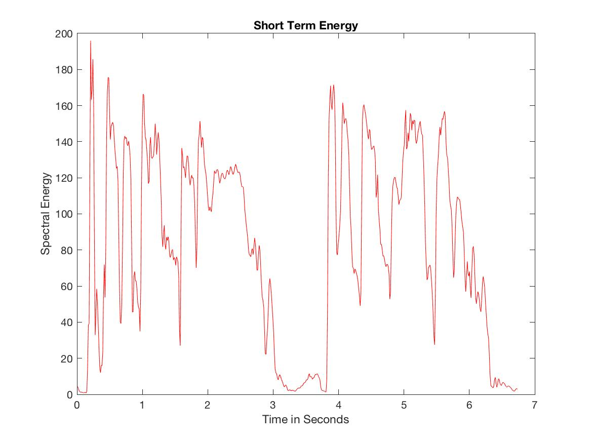

## Pre-processing

### Why do we need to pre-process the signal?

In order to create a working harmonizer, we needed to be able to process voiced and voiceless sounds separately. Voiced sounds should be transposed, but voiceless sounds should not. Voiced sounds are produced by vibrations of the vocal folds and are filtered by the vocal tract. These are the sounds that we want to transpose, while keeping the formants created by the filtering of the vocal tract the same. Several methods have been developed for voiced/voiceless sound recognition and separation. One approach uses the zero crossing rate and the short term energy. In order to test our code, we used an acapella excerpt from the song ["Champagne" by MuruMuru](https://open.spotify.com/track/32nlotNdfPe5PjyEovnrM7?si=IEqlPLsLTxqynP417MJfDA). The file can be found on our GitHub repository.

#### Zero Crossing Rate

The zero crossing rate of a signal is defined as the rate of sign changes of the signal. Generally, voiceless sounds have a higher zero crossing rate than voiced sounds, as they are composed of sibilances, plosives, etc. By varying a zero crossing rate threshold, we can fine tune our detection of voiceless sounds using the zero crossing rate. In MATLAB, we can compute the zero crossing rate of a frame by taking the average of sign difference of the samples within the frame in the following fashion:

```c++
zcr = 0.5 * mean ( abs( diff( sign( input ))));
```

The function ```diff ``` returns the value of ```sign(input(n)) - sign(input(n-1))``` for n = 2 to n = N. We can test different thresholds and determine a value that works for our purposes. If the zero crossing rate of the signal exceeds the threshold, we assume that the current sound is voiceless, and should not be transposed. The following graph shows the zero crossing rate of the test file:


#### Short Term Energy

The short term energy of a signal is defined as sum of the square of the value of the samples. An average is taken to avoid dependency on the frame length. A similar result can be achieved by getting the sum of the absolute value of the samples. In general, the short term energy for voiced sounds should be rather stable. If we compare the short term energy of a frame with the previous one and find a significant difference, this may indicate that the signal contains a voiceless sound. In MATLAB we can implement such formula in the following fashion, for n = 1 to n = N:

```c++
ste = mean( sum(abs( ( y(n) ))))
```
The following graph shows the short term energy of the test file:



### Comparing STE and ZCR

For each frame in the signal, we can compute the STE and ZCR to decide if the gain of the frame should be kept the same or should be lowered. We define a threshold for each, as well as a gain for the frames that are over the threshold.
In order to make the transitions smoother, we can define a fade in and fade out. We can compare the current frames' STE and ZCR and compare them to the previous frame to determine the gain needed: 1.0 (no change), fade in, fade out or the lower, user defined gain.
The following graphs show the unprocessed test signal, as well as the signal processed using the ZCR with a threshold of 0.25 and the signal processed using the STE with a threshold of 140. The lower gain is set at 0.1.


### Comparing VST Plugin to Max External
> describe thought process and choices


| Max/MSP Patcher/Abstraction      | Max External  | VST Plugin (Using MATLAB)   |
|:----------------------|:------------------------|:-----------------------------|
|Less flexibility for sample by sample processing| Sample by sample and frame by frame manipulation|Sample by sample and frame by frame manipulation|  
|Fast prototyping and testing | Laborious to write, test and debug     | Faster prototyping, testing and debugging. audioTestBench included in MATLAB   |
|No coding/compiling         | Max SDK needed          | MATLAB Audio System Toolbox includes generateAudioPlugin function              |

